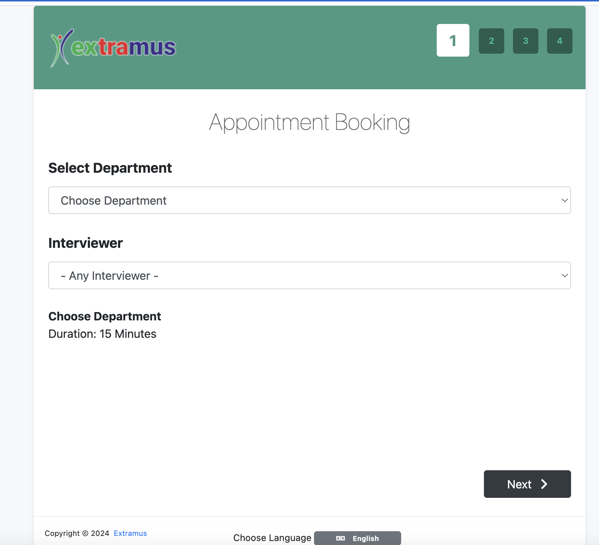

<h1 align="center">
     
    
     
    Extramus Appointments
     
</h1>

 

<h4 align="center">
    A powerful Open Source Appointment Scheduler that can be installed on your server. 
</h4>

 

  <a href="#about">About</a> •
  <a href="#features">Features</a> •
  <a href="#license">License</a>

## About

**Extramus Appointments** is a highly customizable web application that allows customers to book appointments with you 
via a sophisticated web interface. Moreover, it provides the ability to sync your data with Google Calendar so you can 
use them with other services. It is an open source project that you can download and install **even for commercial use**. 
Easy!Appointments will run smoothly with your existing website as it can be installed in a single folder of the 
server and of course share an existing database.

## Features

The application is designed to be flexible enough so that it can handle any enterprise work flow. 

* Customers and appointments management.
* Services and providers organization.
* Working plan and booking rules.
* Google Calendar synchronization.
* Email notifications system.
* Self hosted installation.
* Translated user interface.
* User community support. 

 
That's it! You can now use Extramus!Appointments at your will.
 
## License 

Code Licensed Under [GPL v3.0](https://www.gnu.org/licenses/gpl-3.0.en.html) | Content Under [CC BY 3.0](https://creativecommons.org/licenses/by/3.0/)

 
